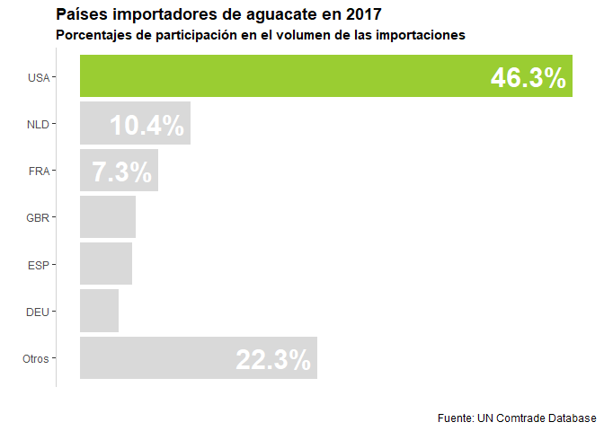

# Generalidades

El aguacate es un fruto proveniente del árbol del mismo nombre, endémico de la región que abarca desde el centro de México hasta Centroamérica con alrededor de 90 especies en el continente americano [@Cnb19]. Por sus elevadas propiedades nutricionales y diversidad de usos industriales el aguacate^[En los sucesivo se empleará el término aguacate para hacer referencia al fruto del árbol del aguacate] se ha convertido en un fruto apreciado en el mercado internacional, por lo que su producción y comercialización se ha propagado por distintas partes del mundo.

<label for="tufte-mn-" class="margin-toggle">&#8853;</label><input type="checkbox" id="tufte-mn-" class="margin-toggle">En promedio 94 países tuvieron participación comercial como exportadores de aguacate y 130 como importadores durante el periodo comprendido entre los años 2008 y 2017.
Prueba de lo anterior es el registro en un solo año de un máximo de 102 países exportadores de aguacate y de un máximo de 136 países con registros de importación, cifras alcanzadas en 2013 y 2008, respectivamente, dentro de un universo de 195 países [@Uct19]. Sin embargo, en términos de los volumenes comerciados de manera individual y valoración del fruto se puede hablar de participantes preponderantes como se verá a continuación. 

# Principales jugadores

## Importadores

De un volumen estimado en 2,003,862 toneladas de aguacate correspondiente a las importaciones efectuadas en 2017, se tiene que el mercado estadounidense es por mucho el de mayor participacón con poco mas del 46% del total de las importaciones, seguido por Holanda, Francia, Gran Bretaña, España y Alemania que, en conjunto, concentran prácticamente el 80% de las importaciones.

Si bien el volumen de importaciones da una idea de la magnitud física de lo comerciado, este indicador no da cuenta del aprecio de los productos en los diferentes mercados, por ello resulta conveniente revisar la prelación de las importaciones de aguacate a partir de su indicador del valor: volumen multiplicado por su precio.

<table>
<caption>Top 6 de países importadores de aguacate en 2017 (fuente: UN Comtrade Database)</caption>
 <thead>
  <tr>
   <th style="text-align:center;"> País </th>
   <th style="text-align:center;"> tons </th>
   <th style="text-align:center;"> usd_kg </th>
  </tr>
 </thead>
<tbody>
  <tr>
   <td style="text-align:center;width: 4cm; "> USA </td>
   <td style="text-align:center;width: 4cm; "> 927,959 </td>
   <td style="text-align:center;width: 4cm; "> $2.94 </td>
  </tr>
  <tr>
   <td style="text-align:center;width: 4cm; "> NLD </td>
   <td style="text-align:center;width: 4cm; "> 207,465 </td>
   <td style="text-align:center;width: 4cm; "> $2.66 </td>
  </tr>
  <tr>
   <td style="text-align:center;width: 4cm; "> FRA </td>
   <td style="text-align:center;width: 4cm; "> 145,967 </td>
   <td style="text-align:center;width: 4cm; "> $3.06 </td>
  </tr>
  <tr>
   <td style="text-align:center;width: 4cm; "> GBR </td>
   <td style="text-align:center;width: 4cm; "> 105,064 </td>
   <td style="text-align:center;width: 4cm; "> $2.69 </td>
  </tr>
  <tr>
   <td style="text-align:center;width: 4cm; "> ESP </td>
   <td style="text-align:center;width: 4cm; "> 98,056 </td>
   <td style="text-align:center;width: 4cm; "> $2.55 </td>
  </tr>
  <tr>
   <td style="text-align:center;width: 4cm; "> DEU </td>
   <td style="text-align:center;width: 4cm; "> 72,710 </td>
   <td style="text-align:center;width: 4cm; "> $3.79 </td>
  </tr>
</tbody>
</table>

El único cambio observado en la posición de los países compradores de aguacate en el mercado internacional al considerar el valor como medida para su ordenación, ocurre entre España y Alemania, siendo este último el que mejora su posición, dada su mayor valoración del fruto. 

El desenvolvimiento de cada uno de los mercados es otro aspecto que deja de manifiesto el importante papel que juegan los actores principales hasta ahora identificados. La forma aquí adoptada para revisar la evolución de estos mercados a través del tiempo requiere del cálculo de la tasa de crecimiento anual promedio (TCAP) del valor de las importaciones en los últimos 10 años. Sin embargo, dada las importantes diferencias en las magnitudes de su valor, principalmante entre los Estados Unidos y el resto de los países importadores, las tasas deben ser ponderadas para de esta forma permitiendo una comparativa más precisa. Se opta por utilizar como medida de relativización la proporción del valor de las importaciones en 2017 de cada país respecto al mayor valor encontrado en ese mismo año que, en este caso, corresponde al de los Estados Unidos. A esta forma ponderada de las tasas de crecimiento se le denominará tasa de crecimiento anual promedio relativa (TCAPr).

<table>
<caption>Top 10 de países con las mayores tasas relativas de crecimiento anual promedio del valor de las importaciones de aguacate, 2008-2017 (fuente: UN Comtrade Database)</caption>
 <thead>
  <tr>
   <th style="text-align:center;"> País </th>
   <th style="text-align:center;"> TCAP </th>
   <th style="text-align:center;"> TCAPr </th>
  </tr>
 </thead>
<tbody>
  <tr>
   <td style="text-align:center;width: 4cm; "> USA </td>
   <td style="text-align:center;width: 4cm; "> 13.4% </td>
   <td style="text-align:center;width: 4cm; "> 13.4% </td>
  </tr>
  <tr>
   <td style="text-align:center;width: 4cm; "> NLD </td>
   <td style="text-align:center;width: 4cm; "> 15.9% </td>
   <td style="text-align:center;width: 4cm; "> 3.2% </td>
  </tr>
  <tr>
   <td style="text-align:center;width: 4cm; "> DEU </td>
   <td style="text-align:center;width: 4cm; "> 15.6% </td>
   <td style="text-align:center;width: 4cm; "> 1.6% </td>
  </tr>
  <tr>
   <td style="text-align:center;width: 4cm; "> ESP </td>
   <td style="text-align:center;width: 4cm; "> 15.8% </td>
   <td style="text-align:center;width: 4cm; "> 1.4% </td>
  </tr>
  <tr>
   <td style="text-align:center;width: 4cm; "> GBR </td>
   <td style="text-align:center;width: 4cm; "> 13.8% </td>
   <td style="text-align:center;width: 4cm; "> 1.4% </td>
  </tr>
  <tr>
   <td style="text-align:center;width: 4cm; "> FRA </td>
   <td style="text-align:center;width: 4cm; "> 5.9% </td>
   <td style="text-align:center;width: 4cm; "> 1.0% </td>
  </tr>
  <tr>
   <td style="text-align:center;width: 4cm; "> JPN </td>
   <td style="text-align:center;width: 4cm; "> 11.0% </td>
   <td style="text-align:center;width: 4cm; "> 0.8% </td>
  </tr>
  <tr>
   <td style="text-align:center;width: 4cm; "> HKG </td>
   <td style="text-align:center;width: 4cm; "> 38.8% </td>
   <td style="text-align:center;width: 4cm; "> 0.8% </td>
  </tr>
  <tr>
   <td style="text-align:center;width: 4cm; "> BEL </td>
   <td style="text-align:center;width: 4cm; "> 25.7% </td>
   <td style="text-align:center;width: 4cm; "> 0.8% </td>
  </tr>
  <tr>
   <td style="text-align:center;width: 4cm; "> KOR </td>
   <td style="text-align:center;width: 4cm; "> 33.1% </td>
   <td style="text-align:center;width: 4cm; "> 0.4% </td>
  </tr>
</tbody>
</table>

Dos aspectos a destacar: en el top 6 de países importadores de aguacate ordenados de acuerdo a su crecimiento anual promedio relativo se encuentran los mismos participantes que en las listas ordenas por su volumen y por su valor, lo que indica que estos países no solo son atractivos en términos de su tamaño, también lo son por su estado evolutivo que se muestra aún en una fase de expansión. 

# Referencias
